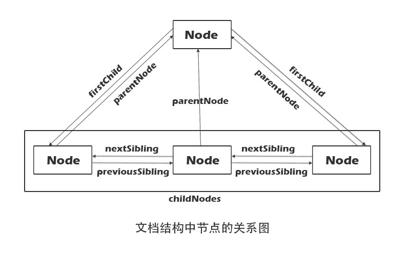

## DOM
### 节点层次
	DOM可以将任何HTML或XML文档描绘成一个由多层节点构成的结构。节点分几种不同的类型，每种类型分别表示文档中不同的信息及标记。每个节点都拥有各自的特点，数据和方法，另外也与其他节点存在某种关系。
##### Node 类型
	节点类型由Node类型中定义的下列12个数值常量来表示。
	Node.ELEMENT_NODE(1)
	Node.ATTRIBUTE_NODE(2)
	Node.TEXT_NODE(3)
	Node.CDATA_SECTION_NODE(4)
	Node.ENTITY_PEFERENCE_NODE(5)
	Node.ENTITY_NODE(6)
	Node.PROCESSING_INSTRUCTION_NODE(7)
	Node.COMMENT_NODE(8)
	Node.DOCUMENT_NODE(9)
	Node.DOCUMENT_TYPE_NODE(10)
	Node.DOCUMENT_FRAGMENT_NODE(11)
	Node.NOTATION_NODE(12)
1. nodeName 和 nodeValue 属性
  要了解节点的具体信息，可以使用nodeName和nodeValue这两个属性。这两个属性的值完全取决于节点的类型。

2. 节点关系

  

3. 操作节点
	appendChild，用于向childNodes列表的末尾添加一个节点。更新完成后，appendChild返回新增的节点。如果需要把节点放在childNodes列表中某个特定的位置上，而不是放在末尾，那么可以使用insertBefore方法。插入节点后，被插入的节点会变成参考节点的前一个同胞节点（previousSibling），同时被方法返回。
4. 其他方法
	cloneNode，用于创建调用这个方法的节点的一个完全相同的副本。cloneNode()方法接受一个布尔值参数，表示是否执行深度复制。执行深复制，也就是复制节点及其整个子节点树，在参数为false的情况下，执行浅复制，即只复制节点本身。
	cloneNode方法不会复制添加到DOM节点中的javascript属性。如事件处理程序等。这个方法只复制特性、子节点，其他一切都不会复制。IE在此存在一个bug，即它会复制事件处理程序，所有我们建议在复制之前最好先移除事件处理程序。
	
##### Document类型
	在浏览器中，document对象是HTMLDocument（继承自Document类型）的一个实例，表示整个HTML页面。而且，document对象是window对象的一个属性，因此可以将其作为全局对象来访问。
##### Element 类型

